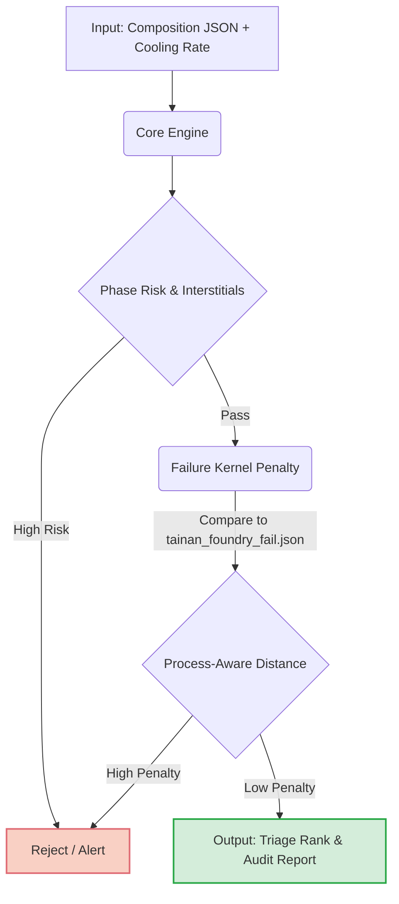

# 9B-MMX: Computational Alloy Screening Prototype


**9B-MMX** is a high-throughput, rule-based computational pre-screening engine designed to identify and triage casting failure risks in metastable structural alloys before physical melting.

> **Important Disclaimer**: This tool is a pre-screening computational filter. It is **not** a substitute for physical melting, microscopy, phase identification, or mechanical testing. All predictions and cost values are heuristic estimates for risk-alerting, not guaranteed material specifications.

---

## 1. The Problem We Solve

Traditional alloy design faces a significant bottleneck: bridging the gap between theoretical composition design and actual foundry casting risks.
* **Physical trials are expensive and slow**: Melting hundreds of exploratory alloys to find one viable candidate is cost-prohibitive.
* **CALPHAD / DFT are computationally heavy**: While highly accurate for equilibrium states, these methods are often too slow for rapid, high-throughput screening of massive compositional search spaces.

**The Solution:** 9B-MMX acts as a **first-pass filter**. It rapidly calculates heuristic physical descriptors (SFE, VEC, PREN, Sieverts' Law solubility) and cross-references process conditions (e.g., cooling rates) against a known failure database. By pruning high-risk compositions instantly, researchers can focus their expensive CALPHAD models and physical melts only on the top 5% lowest-risk candidates.

---

## 2. Core Use Cases

9B-MMX is designed for materials scientists, metallurgists, and researchers exploring complex multi-principal element alloys (MPEAs).

### ❄️ Cryogenic High-Manganese Steel Development
Design advanced Fe-Mn-Cr-Ni-C-N alloys for extreme low-temperature toughness. 9B-MMX evaluates candidates for risk of brittle $\sigma$-phase formation and interstitial (C/N) precipitation during slow cooling, ensuring toughness isn't compromised by manufacturing constraints.

### 🚀 High-Throughput Candidate Triaging
Process hundreds of theoretical alloy compositions via the Batch CLI. The engine ranks them by safety distance against known failures, allowing you to quickly triage out compositions likely to crack or form deleterious phases.

### 💰 Cost-Constrained Alloy Discovery
Balance estimated raw material cost against heuristic stacking fault energy (SFE) to discover economical TRIP/TWIP steel alternatives without sacrificing required deformation mechanisms.

---

## 3. How It Works: The Screening Pipeline

9B-MMX employs a three-layer screening pipeline to evaluate candidate viability:



1. **Composition & Physics Validation**: Calculates substitution descriptors (VEC, $\delta$, $\Delta H_{\text{mix}}$) and experimental interstitial limits (Sieverts' Law, N/C solubility).
2. **Phase Boundary Rules**: Flags risks like $\sigma$-phase ($6.8 \le VEC \le 7.6$), TCP Laves-phase, and interstitial grain-boundary $\text{Cr}_2\text{N}$ / $\text{M}_{23}\text{C}_6$ precipitates.
3. **Historical Failure Kernel**: Calculates a Gaussian kernel distance against known casting failures, scaling the penalty based on dynamic cooling rates ($CR$).

---

## 4. Current Achievements vs. Limitations

### ✅ Current Achievements (Phase 3)
* **High-Throughput Speed**: Executes sub-second audits per candidate, easily scaling to batch triage.
* **Process-Awareness**: Actively scales failure penalties based on dynamic cooling rates, accurately modeling precipitation suppression kinetics during fast cooling.
* **Modular Architecture**: Shared core (`src/core/`) wrapped in UMD for seamless execution across Node.js CLI and Browser environments.

### ⚠️ Known Limitations
* **Heuristic Engine**: 9B-MMX relies on empirical heuristics. It **does not** run thermodynamic equilibrium phase diagrams or first-principles density functional theory calculations.
* **Limited Failure Database**: The current `tainan_foundry_fail.json` database contains only 8 reference records. It requires user-provided empirical data to become highly predictive for specific alloy systems.
* **Approximate Cost Index**: Raw material costs are simple weight-percent heuristic estimates, not dynamic currency tracking.

---

## 5. Quick Start

### Prerequisites
* [Node.js](https://nodejs.org/) (Version 16 or higher recommended)

### Run Single Candidate Audit
Clone this repository, navigate to the folder, and run:
```bash
npm install
npm run audit
```
This runs the engine on the default stress-test proxy `Fe46-Mn24-Cr18-Ni10-N2`. Output reports are saved to `logs/physics_audit_report.md`.

### Run High-Throughput Batch Screening
To evaluate a batch of candidates:
```bash
node agy.js /batch-screen --input=examples/search_seeds/batch_seeds_example.json --output=logs/triage_report.json
```
This generates a highly organized **Candidate Triage Table** classifying compositions into lower-risk ranks or triaged-out records.

---

## 6. Repository Structure

```text
├── AGENTS.md                  # Declarative sandboxing & threshold limits
├── agy.js                     # Primary batch triaging & screening CLI script
├── agy_rhea_gen.js            # Refractory HEA screening engine
├── agy_stainless.js           # Stainless steel checking module
├── package.json               # Package setup & run scripts
├── README.md                  # Main repository homepage (this file)
├── src/
│   ├── core/                  # Shared computation engine (descriptors, penalty, interstitial)
│   └── quantum/
│       ├── candidate_gen/     # Candidate generator isolated write zone
│       └── physics_auditor/   # Physics consistency auditor isolated write zone
├── docs/
│   ├── methodology.md         # Equations, boundaries, and assumptions
│   ├── search_direction.md    # Fe-Mn-Cr-Ni-C-N future research roadmap
│   └── demo_run.md            # Fact-based demo run log
├── logs/
│   ├── tainan_foundry_fail.json # Historical/proxy failure-distance records
│   ├── physics_audit_report.json# Executed JSON run report
│   └── physics_audit_report.md  # Compiled Markdown screening report
└── examples/
    ├── hea_config_99.json     # Legacy demo reference composition JSON
    ├── logs/                  # Examples of generated triage reports
    ├── sample_report.md       # Pre-run sample screening report copy
    └── search_seeds/          # Conceptual search seeds (Fe-Mn-Cr-Ni-C-N)
```

---

## 7. License
This prototype is released under the MIT License.
