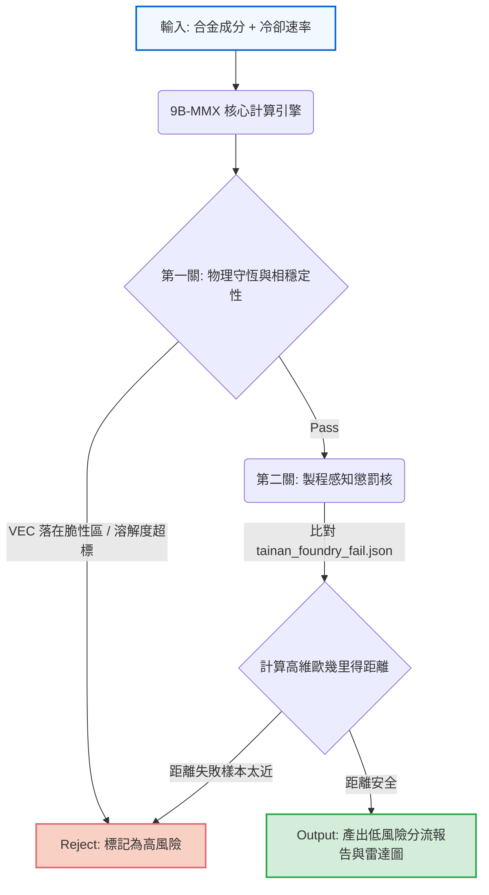

# 9B-MMX: Computational Alloy Screening Prototype


**9B-MMX** is a high-throughput, rule-based computational pre-screening engine designed to instantly flag casting risks and triage metastable structural alloys *before* committing to expensive physical melts or heavy CALPHAD simulations.

> **Important Disclaimer**: This tool is a pre-screening computational filter. It is **not** a substitute for physical melting, microscopy, phase identification, or mechanical testing. All predictions and cost values are heuristic estimates for risk-alerting, not guaranteed material specifications.

---

## 1. 痛點與解決方案 (The Problem We Solve)

### 🚨 為什麼我們需要這個工具？
傳統的合金開發面臨著嚴重的「死亡之谷 (Valley of Death)」。當我們透過機器學習或直覺設計出全新的多主元合金 (MPEAs) 或高錳鋼配方時，通常會面臨兩個極端的瓶頸：
1. **實體試錯成本過高 (Physical Casting is Expensive)**：直接把幾百種理論配方送進熔爐，會耗費數十萬的資金與幾個月的時間，最後卻發現大部分的合金在冷卻過程中就因為脆性相 (如 $\sigma$ 相) 或碳氮化物析出而直接開裂。
2. **熱力學模擬太慢 (CALPHAD is Slow)**：Thermo-Calc 等軟體雖然精準，但在面對包含 Fe-Mn-Cr-Ni-C-N 等 6 元以上系統時，計算龐大搜尋空間的相圖需要極長的運算時間，無法應付「高通量海選 (High-Throughput Screening)」。

### 💡 9B-MMX 的價值：終極的「Fail-Fast」過濾器
9B-MMX 的定位不是取代精密模擬，而是作為**「第一道快篩防線」**。它透過預先建立的物理經驗法則 (如 SFE、VEC、Sieverts' Law) 與實體失敗記憶庫，能在 **1 秒內篩選數千種配方**，瞬間將 95% 註定會因為物理限制而失敗的配方剔除。

**這能為您省下巨大的時間與金錢：讓您的 CALPHAD 算力與昂貴的實體熔爐，只專注在過關的那 5% 最有潛力的「低風險名單 (Lower-Risk Candidates)」上。**

---

## 2. 核心使用情境 (Core Use Cases)

9B-MMX 特別適合材料科學家、冶金工程師以及從事合金設計的 AI 研究人員。

### ❄️ 情境一：低溫高錳鋼 (Cryogenic High-Mn Steel) 開發
當您試圖在 Fe-Mn-Cr-Ni 基礎上加入大量碳 (C) 與氮 (N) 來追求極致低溫韌性時，9B-MMX 能瞬間幫您評估該成分在特定的**冷卻速率 (Cooling Rate)** 下，是否會因為過飽和而產生致命的晶界析出，確保設計出的合金在實際鑄造時不會直接報廢。

### 🚀 情境二：高通量海選 (High-Throughput Candidate Triaging)
如果您有一個 AI 模型生成了 10,000 種潛在的合金配方，您可以直接將 JSON 餵給 9B-MMX 的 Batch CLI。系統會根據已知的「鑄造失敗資料庫」計算懲罰距離，自動為您產出一份 **Triage Report (分流報告)**，直接將高風險與低風險配方分門別類。

### 💰 情境三：成本受限的性能探索 (Cost-Constrained Alloy Discovery)
透過整合簡易的原料成本估算與層錯能 (SFE) 指標，您可以在 9B-MMX 的 Dashboard 上即時拖曳滑桿，尋找能在維持 TWIP/TRIP 變形機制的同時，最大幅度降低昂貴元素 (如 Ni, Co) 佔比的經濟型替代方案。

---

## 3. 運作原理：管線與流程圖 (The Screening Pipeline)

9B-MMX 採用輕量化的 Node.js 核心，將驗證流程分為三個防護網：



1. **基本物理量計算**：計算價電子濃度 (VEC)、原子尺寸差 ($\delta$)、混合焓 ($\Delta H_{\text{mix}}$)、層錯能 (SFE) 與 PREN。
2. **熱力學邊界判定**：阻擋落入已知脆性相 (如 $\sigma$-phase, $6.8 \le VEC \le 7.6$) 與 TCP Laves-phase 的成分，並透過 Sieverts' Law 攔截間隙原子 (C/N) 超標的成分。
3. **歷史失敗懲罰核 (Failure Kernel)**：將成分與冷卻速率映射到高維空間，計算與已知失敗樣本 (如實驗室曾鑄造裂開的廢料) 的高斯距離。若過於相近，則直接判定為高風險。

---

## 4. 我們的優勢與極限 (Achievements vs. Limitations)

### ✅ 優勢 (Why it works)
* **極致高速**：無需解熱力學微分方程，每筆配方審核不到 1 毫秒，完美支援批次處理。
* **製程感知 (Process-Awareness)**：不僅看成分，還會根據輸入的**冷卻速率 (Cooling Rate)** 動態調整析出懲罰權重。冷卻越慢，間隙原子析出懲罰越重。
* **視覺化 Dashboard**：內建 Python Streamlit 介面，讓非工程背景的學者也能輕鬆拉動滑桿，即時觀看合金物理足跡 (Radar Chart)。

### ⚠️ 限制 (Known Limitations)
* **非絕對精準 (Heuristic Engine)**：9B-MMX 依賴經驗法則，**絕對無法取代 Thermo-Calc 或 DFT**。它的目的是「粗篩剔除壞蘋果」，而非「精確描繪好蘋果的細節」。
* **極度依賴外部失敗數據**：預設的失敗資料庫 `tainan_foundry_fail.json` 僅有少數示範紀錄，使用者必須自行匯入自己實驗室的真實失敗數據，模型的攔截能力才會隨著資料庫變大而越發精準。

---

## 5. 快速上手 (Quick Start)

### 啟動視覺化 Dashboard (強烈推薦)
最快體驗 9B-MMX 威力的方式是啟動展示面板：
```bash
# 確保已安裝 Python 環境與套件
pip install -r requirements.txt
npm install
npm run dashboard
```
這將開啟一個 Streamlit 網頁，您可以在其中調整元素滑桿，並立即看到合金的雷達圖與風險評估。

### 使用命令列進行批次海選 (Batch Screening CLI)
針對大量資料，我們提供高效能 CLI 工具：
```bash
node agy.js /batch-screen --input=examples/search_seeds/validation/batch_val_seeds.json --output=logs/triage_report.json
```
執行後會產生一份結構化的分流報告，明確指出哪些配方可以直接放棄，哪些值得送進下一階段。

---

## 6. 專案架構 (Repository Structure)

```text
├── agy.js                     # 核心 CLI 與批次處理腳本
├── dashboard.py               # Streamlit 視覺化展示面板
├── requirements.txt           # Python 依賴清單
├── README.md                  # 專案說明文件 (本文)
├── src/
│   ├── core/                  # UMD 跨平台核心演算法 (descriptors, penalty, interstitial)
│   └── quantum/               # 隔離寫入區
├── docs/
│   └── validation_report.md   # 模型預測 vs. 文獻實測的嚴謹誤差分析報告
├── logs/
│   └── tainan_foundry_fail.json # 歷史失敗/代理懲罰資料庫
└── examples/
    └── search_seeds/          # 供測試的合金 JSON 種子
```

---

## 7. License
This prototype is released under the MIT License.
